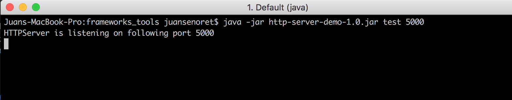
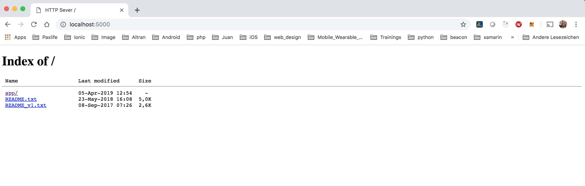
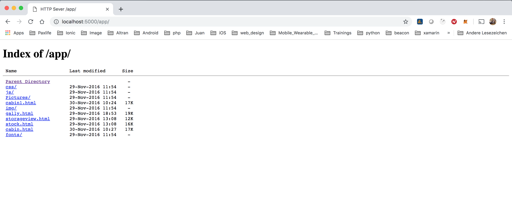
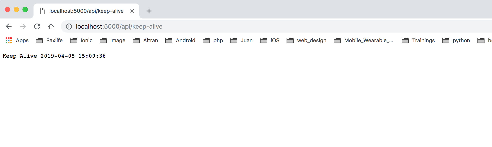
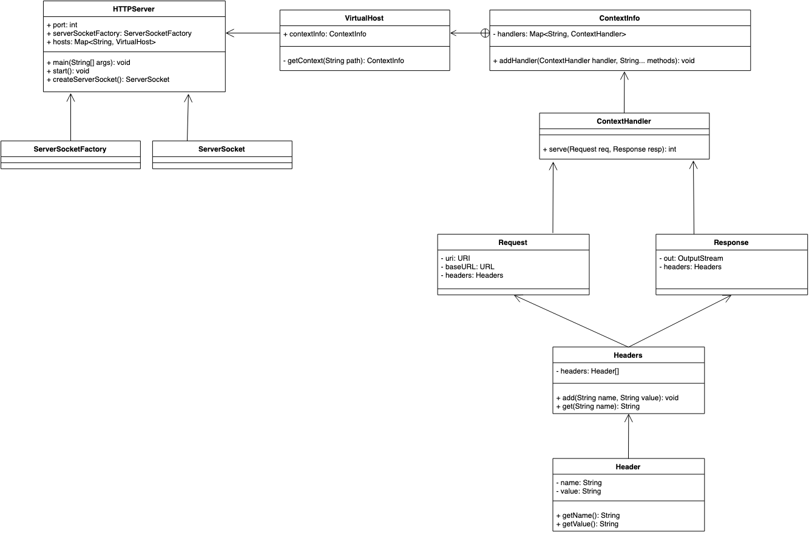

# HTTP Server based on JLHTTP - Java Lightweight HTTP Server

HTTP Server is a sample HTTP web server to demonstrate how to create a light HTTP server for listing of the files and subdirectories in the specified directory


## Getting Started

These instructions will get you a copy of the project up and running on your local machine for development and testing purposes.

### Prerequisites

Please make sure you've already installed JRE free of charge from Oracle.

- Go to [http://www.oracle.com/technetwork/java/javase/downloads/index.html]

- Under Java Platform, Standard Edition, select either the current release, or click Previous Releases to install an earlier supported version.
You can use either the JDK or JRE. The JDK includes the JRE. Do not use any non-supported version or edition of the Java JRE or JDK.

- Follow the navigation aids to download the JRE or JDK that is appropriate for your operating system.

- Follow the installation instructions that are provided with the JRE.

- Save the path to the JRE executable file. You will need it later.

- Verifying the JRE Environment (UNIX and Mac OS). From the command shell of the operating system, issue the following command:
```
java -version
```


### Installing and user guide

A step by step series of examples that tell you have to get use the HTTP Server Demo app

- Clone this repository:

```
git clone https://github.com/JuanSenoret/java-http-server-demo.git
```

- Change directory to ```lib``` folder

```
cd lib
```

- Launch the HTTP Server Demo using the *.jar file, issue the following command

```
java -jar http-server-demo-1.0.jar <folder path> <port number>
```
Folder path argument could be an absolute path or a relative path of a folder located in the same folder of the *.jar file.
Port number is optional (default port is 4200).

E.g.
```
java -jar http-server-demo-1.0.jar /Users/juansenoret/Documents/test 5000
```

Your terminal should look something like this:


Of course you can copy the *.lar file to another folder and launch from there.

- From your browser you can call the following URL (http://localhost:5000/) to check navigate through the folders

Your browser should look something like this:




- A keep alive endpoint was implemented in the demo. From your browser you can call the following URL (http://localhost:5000/api/keep-alive)

Your browser should look something like this:



### UML Diagram


