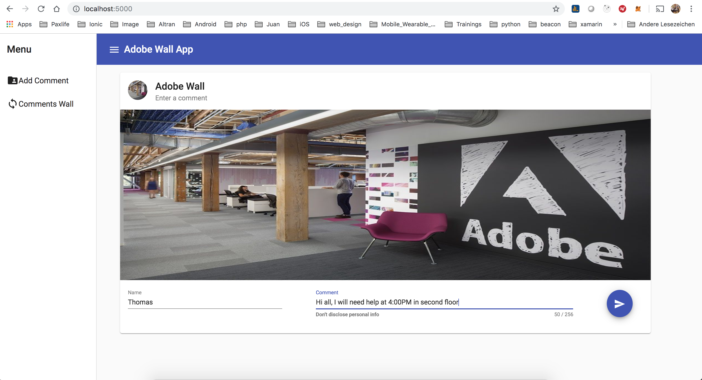
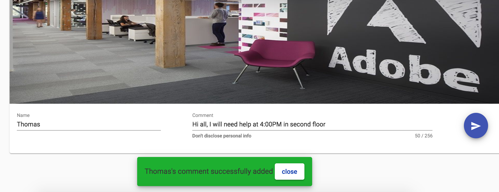
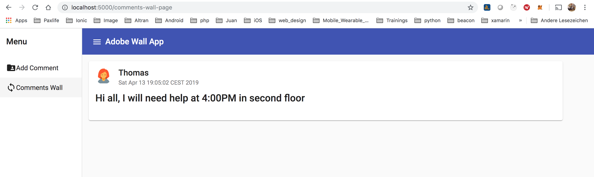
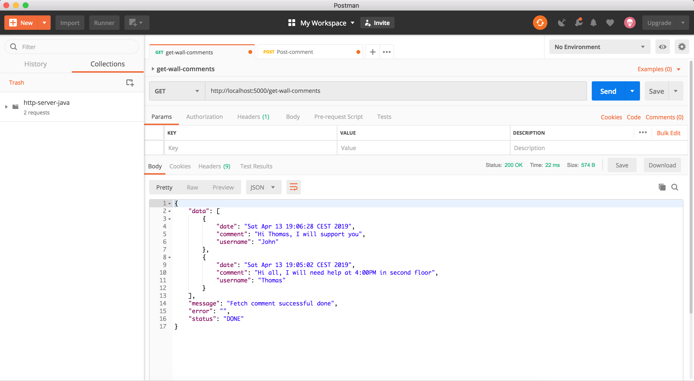
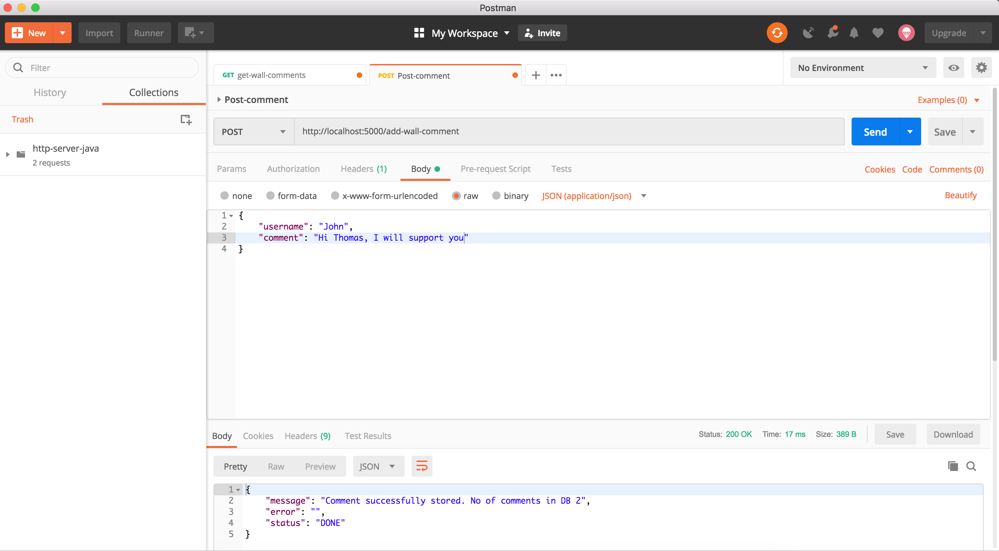

# Adobe Wall served through an Lightweight HTTP Server

In this project you will check how to serve an Angular 7 application using a light weight HTTTP server implemented in JAVA.
You will find two web application served through the same light weight HTTTP server:
- Adobe Wall app: which is a web app to add comment to a MongoDB database
- Finder app: which you can use to serve your files.


## Getting Started

These instructions will get you a copy of the project up and running on your local machine for development and testing purposes.

### Prerequisites

Please make sure you've already installed JRE free of charge from Oracle and MongoDB.

- Go to [http://www.oracle.com/technetwork/java/javase/downloads/index.html]

- Under Java Platform, Standard Edition, select either the current release, or click Previous Releases to install an earlier supported version.
You can use either the JDK or JRE. The JDK includes the JRE. Do not use any non-supported version or edition of the Java JRE or JDK.

- Follow the navigation aids to download the JRE or JDK that is appropriate for your operating system.

- Follow the installation instructions that are provided with the JRE.

- Save the path to the JRE executable file. You will need it later.

- Verifying the JRE Environment (UNIX and Mac OS). From the command shell of the operating system, issue the following command:
```
java -version
```

- To install MongoDB go to [https://docs.mongodb.com/manual/tutorial/install-mongodb-on-os-x/] and follow the instructions

### Installing and user guide

A step by step series of examples that tell you have to get use the HTTP Server Demo app

- Clone this repository:

```
git clone https://github.com/JuanSenoret/java-http-server-demo.git
```

- Change directory to ```lib``` folder

```
cd lib
```

- Be sure you has the MongoDB daemon running and your database doesn't require any credential to connect to it.

- Launch the HTTP Server Demo using the *.jar file, issue the following command

```
java -jar http-server-demo-1.0.jar <folder path>
```
Folder path argument could be an absolute path or a relative path of a folder located in the same folder of the *.jar file.

E.g.
```
java -jar http-server-demo-1.0.jar /Users/juansenoret/Documents/test
```

Your terminal should look something like this:


Of course you can copy the *.jar file to another folder and launch from there.

- From your browser you can call the following URL (http://localhost:5000/) to open the Adobe Wall App. In this web app you
can add your comment to the Adobe wall

Your browser should look something like this:




In that page you can add a new comment to the MongoDB database.

After added a comment cann get all the stored comments in the next page:


- You can call the GET REST API to fetch the comments from the MongoDB database. To do that you can use Postman tool.

Your call via Postman should look something like this:


- You can call the POST REST API to add a new comment to the MongoDB database.

Your call via Postman should look something like this:


- From your browser you can call the following URL (http://localhost:5000/finder) to check and navigate through the folders

Your browser should look something like this:


- A keep alive endpoint was implemented in the demo. From your browser you can call the following URL (http://localhost:5000/api/keep-alive)

Your browser should look something like this:


### UML Class Diagram


